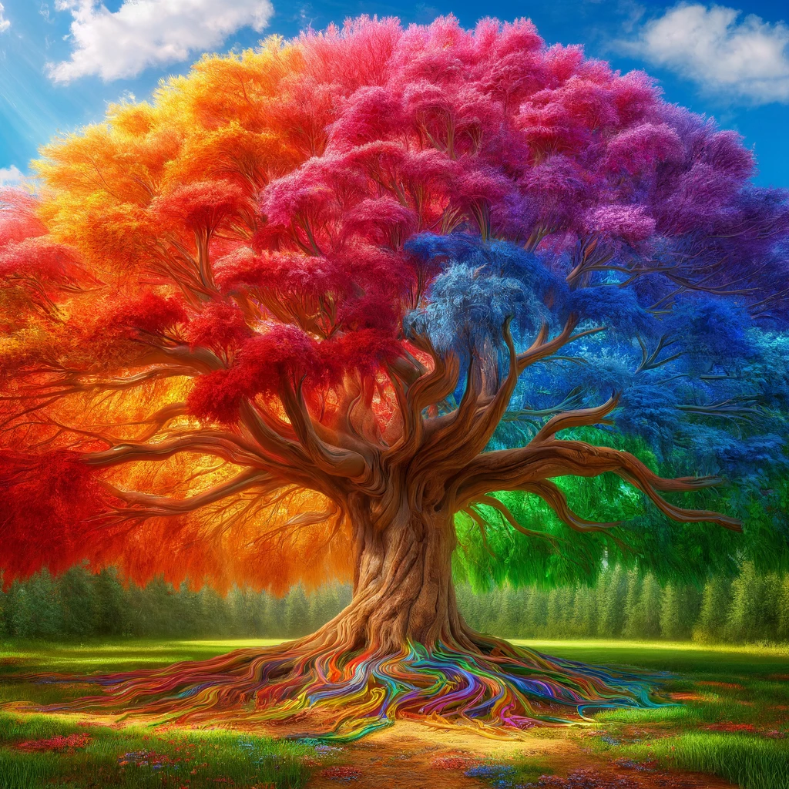
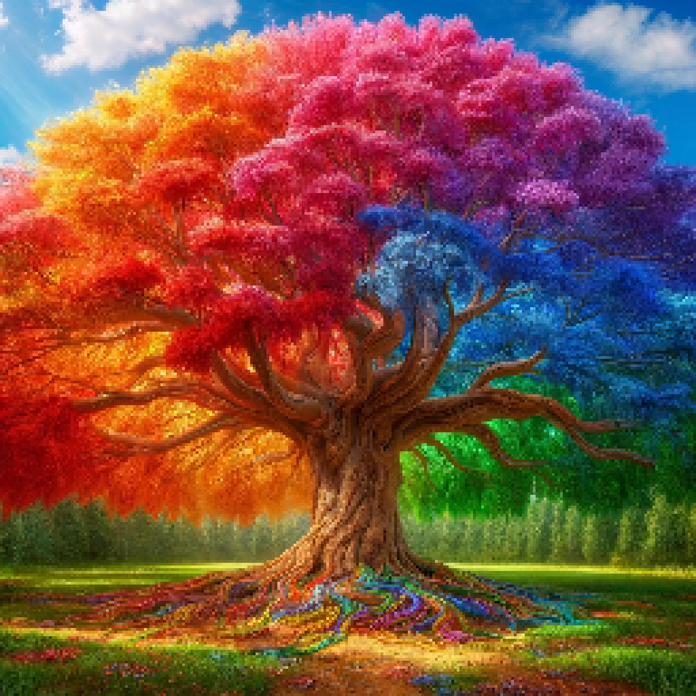

# Stitcher: Cross Stitch Pattern Generator


## Overview
Stitcher is a web application designed to help you create beautiful cross stitch patterns from your images. This application provides several image processing options, including pixelation, color filtering, and cross stitch pattern generation. The final cross stitch pattern can be downloaded as a bundle containing an image, pattern PDF, and color key.

## Features
- **Image Upload**: Upload your image in JPG, JPEG, PNG, or WEBP format.
- **Pixelation**: Option to pixelate the image with a selectable pixelation size.
- **Filters**: Apply various filters to your image (Greyscale, Sepia).
- **Cross Stitch Pattern**: Generate a cross stitch pattern with a specified number of colors.
- **Download Options**: Download pixelated images and cross stitch pattern bundles.

## How to Use
1. **Upload an Image**:
    - Click on the "Upload an image" button in the sidebar.
    - Choose your image file (JPG, JPEG, PNG, or WEBP).

2. **Pixelate Image** (Optional):
    - Check the "Pixelate Image" option.
    - Select the pixelation size from the slider.

3. **Apply Filter**:
    - Select a filter from the dropdown menu. Options include "None", "Greyscale", and "Sepia".

4. **Generate Cross Stitch Pattern**:
    - Check the "Generate Cross Stitch Pattern bundle" option.
    - Select the maximum number of colors for the pattern from the slider.

5. **Process the Image**:
    - Click on the "Process Image" button.

6. **Download**:
    - View the processed images.
    - Use the download buttons to get the pixelated images and the cross stitch pattern bundle.


## Example



pixelated:



Cross stitch pattern:


## File Descriptions
- **Pixelated Image**: A pixelated version of your uploaded image.
- **Cross Stitch Pattern Bundle**: A ZIP file containing:
  - **Image**: The cross stitch pattern image.
  - **Pattern PDF**: A PDF with the cross stitch pattern split into pages.
  - **Color Key**: A text file with the color key for the pattern.

## Dependencies
This application requires the following Python libraries:
- Streamlit
- Pillow (PIL)
- Numpy
- Scikit-learn
- ReportLab
- Pandas
- Pyth

Install the required libraries using:
```bash
pip install -r requirements.txt
```

## Running the Application
To run the application, use the following command:
```bash
streamlit run stitcher.py
```

## Notes
- The application sets the limit for image pixels to avoid `DecompressionBombError`.
- Ensure the `DMC_RGB.csv` file containing DMC color information is available in the same directory as the script.

## Contact
For any queries or issues, please contact via the issues page on github.

Enjoy creating your cross stitch patterns with Stitcher!